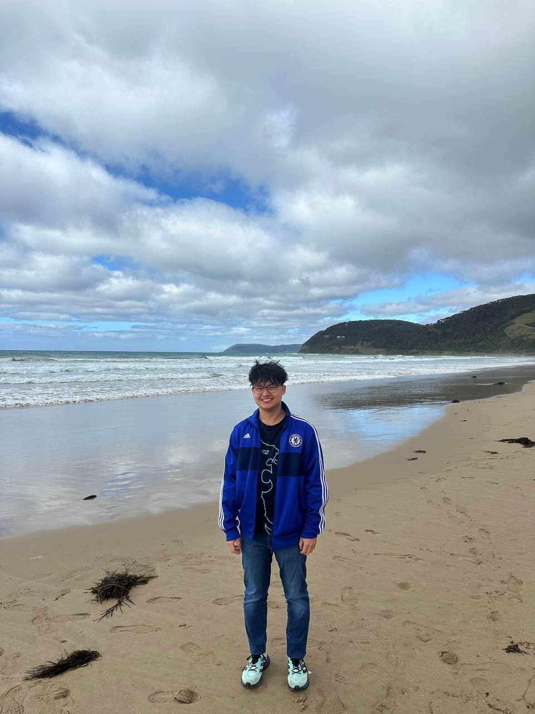
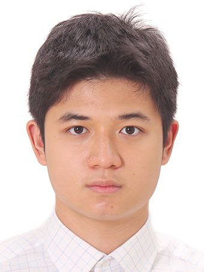

# About Us

We are a team based in the [School of Computing, National University of Singapore](http://www.comp.nus.edu.sg).

You can reach us at the email `seer[at]comp.nus.edu.sg`

## Project team

### Paul Cheng

[[github](https://github.com/itsapaulblem)]

* Role: Documentation 
* Responsibilities: Responsible for the quality of various project documents

### Nguyen Dinh Nam

[[github](https://github.com/namprice227)]

* Role: Team Lead
* Responsibilities: UI

### Zenn Saw

[[github](http://github.com/zenn345)]

* Role: Testing
* Responsibilities: Ensure testing of project is done
