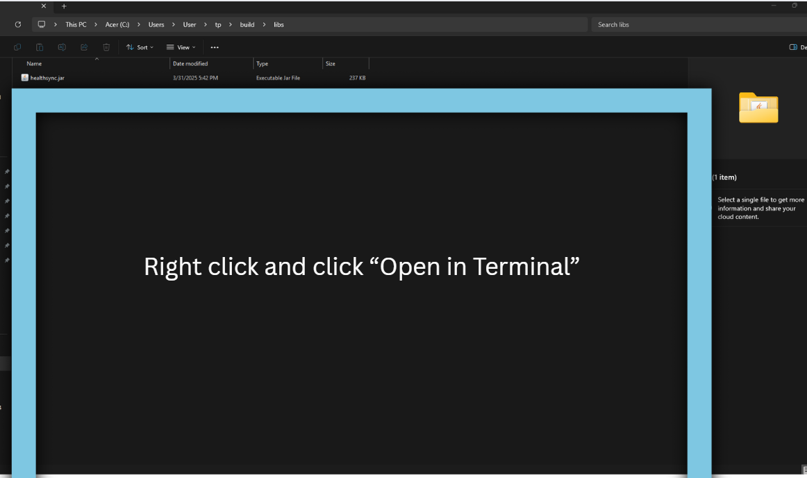
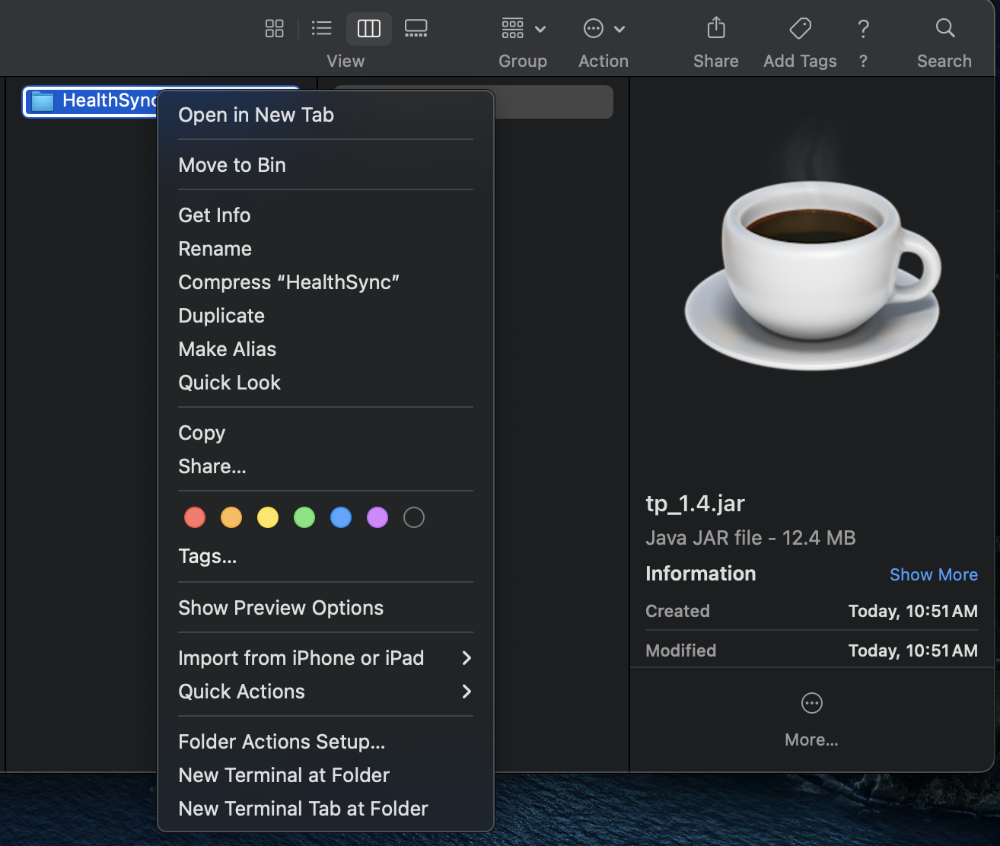
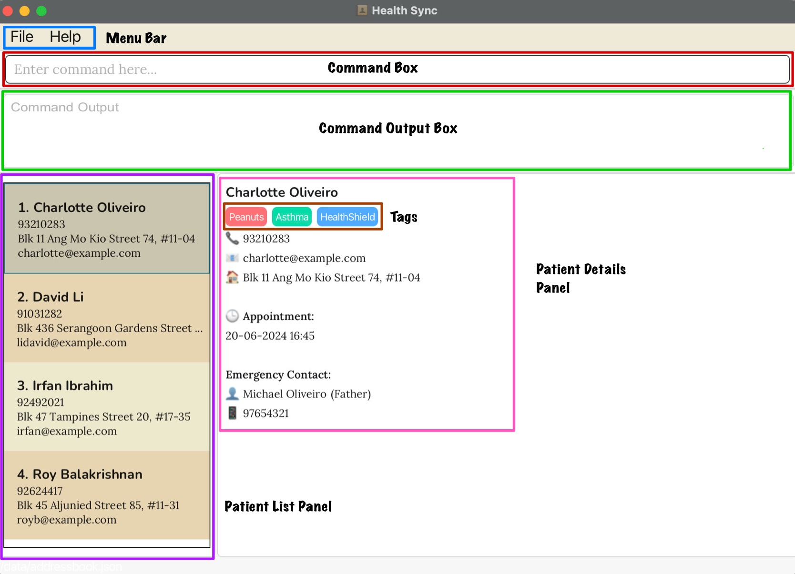
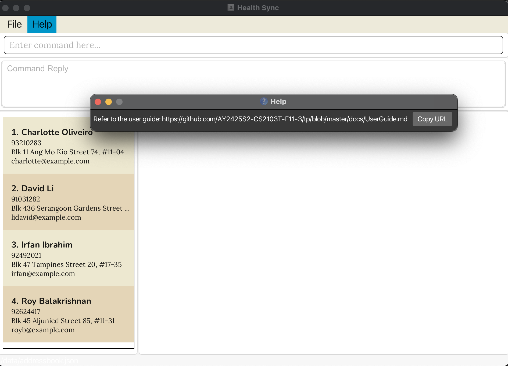
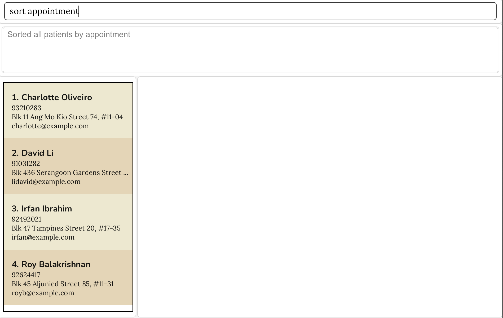
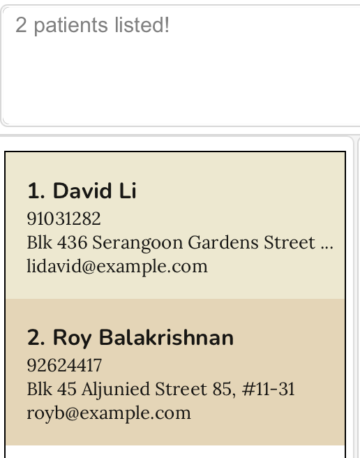
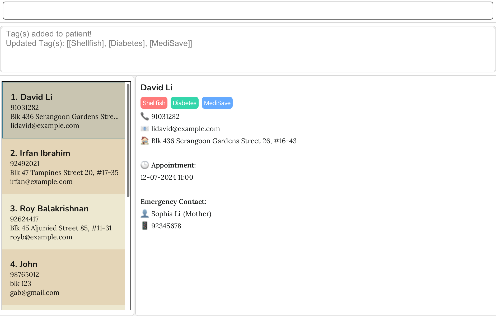
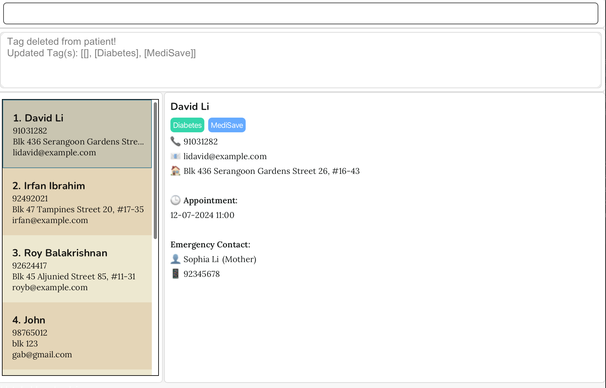

# HealthSync User Guide

---

HealthSync is a **desktop application designed specifically for healthcare administrators in family clinics.** It consolidates patients’ personal details and emergency contact information into a unified, easily accessible database, streamlining the management of critical data.

By integrating the speed and efficiency of a Command Line Interface (CLI) with the design of a Graphical User Interface (GUI), HealthSync empowers fast-typing administrators to retrieve vital patient information and reach out to emergency contacts more swiftly than with traditional GUI-only systems.

This hybrid approach supports rapid responses in a healthcare environment where every second counts.

---

> **⚠️ Warning:** HealthSync is only designed for **Singapore-based family clinics**. It operates exclusively in **English** and does not support other languages or international clinic formats. 
> Using HealthSync with other languages or across multiple countries and timezones may lead to unexpected behaviour.

---
## Table of Contents
1. [How to use this User Guide](#how-to-use-this-user-guide)
2. [Quick Start](#quick-start)
3. [Overview of GUI](#overview-of-gui)
4. [Features](#features)
    - [Viewing help: `help`](#viewing-help--help)
    - [Adding a patient: `add`](#adding-a-patient-add)
    - [Scheduling an appointment: `schedule`](#scheduling-an-appointment-schedule)
    - [Listing all patients: `list`](#listing-all-patients--list)
    - [Sorting patients: `sort`](#sorting-patients--sort)
    - [Editing a patient: `edit`](#editing-a-patient--edit)
    - [Setting emergency contact: `emergency`](#setting-emergency-contact--emergency)
    - [Locating patients by name: `find`](#locating-patients-by-name-find)
    - [Archiving a patient: `archive`](#archiving-a-patient--archive)
    - [Listing archived patients: `listarchive`](#listing-all-patients-in-archive--listarchive)
    - [Unarchiving a patient: `unarchive`](#unarchiving-a-patient--unarchive)
    - [Deleting a patient: `delete`](#deleting-a-patient--delete)
    - [Clearing all entries: `clear`](#clearing-all-entries--clear)
    - [Tag Management](#tag-management)
        - [Adding a tag: `tag`](#adding-a-tag-ta-ti-tc)
        - [Deleting a tag: `tag`](#deleting-a-tag-td)
    - [Undoing a command: `undo`](#undoing-a-command-undo)
    - [Redoing a command: `redo`](#redoing-a-command-redo)
    - [Exiting the program: `exit`](#exiting-the-program--exit)
    - [Saving the data](#saving-the-data)
    - [Editing the data file](#editing-the-data-file)
5. [FAQ](#faq)
6. [Known Issues](#known-issues)
7. [Valid inputs for patient parameters](#valid-inputs-for-patient-parameters)
8. [Command Summary](#command-summary)
9. [Glossary](#glossary)
     - [Terminology](#terminology)

--------------------------------------------------------------------------------------------------------------------
## How to use this User Guide
This User Guide is designed to help you understand and use HealthSync effectively. Below are some tips on how to navigate and use this guide:

1. **[Table of Contents](#table-of-contents)**: Use this to instantly jump to the section you are interested in.
2. **[Quick Start](#quick-start)**: Step-by-step instructions for first-time users.
3. **[Overview of GUI](#overview-of-gui)**: Familiarise yourself with HealthSync's interface.
4. **[Features](#features)**: Detailed explanations of all commands with formats, parameters and examples.
5. **[FAQ](#faq)**: Answers to common questions and troubleshooting tips.
6. **[Known Issues](#known-issues)**: Lists existing issues and their solutions.
7. **[Command Summary](#command-summary)**: A quick reference table for command formats.

By referring to these sections, you can quickly find the information you need and fully utilize HealthSync.

## Legend
**⚠️**: The symbol serves as a warning that executing a specific command in a given context may result in unexpected behavior.

<box type="tip">: The symbol provides helpful guidance on using the command effectively to meet your needs.
</box>

## Quick start

1. Ensure you have Java `17` or above installed in your Computer. 
   * You can check your Java version by following the instructions [here](https://www.wikihow.com/Check-Your-Java-Version-in-the-Windows-Command-Line).
   * If you do not have Java `17` or above installed in your computer, you can download Java from [here](https://www.oracle.com/java/technologies/downloads/#java17).
   * **Mac users:** Ensure you have the precise JDK version prescribed [here](https://se-education.org/guides/tutorials/javaInstallationMac.html).

2. Download the latest release of the `HealthSync.jar` file from [here](https://github.com/AY2425S2-CS2103T-F11-3/tp/releases).

3. Copy the file to the folder you want to use as the _home folder_ for HealthSync. The _home folder_ will be where all the data files will be saved.

4. For *Windows:* Open the home folder and right-click anywhere in the blue box, as shown in the image below. Click "Open in Terminal". A terminal window will pop up, then type in the command `java -jar HealthSync.jar` to run the application.

   

   For *MacOS:* Right-click home folder. Select "New Terminal at folder". A terminal window will pop up, then type in the command `java -jar HealthSync.jar` to run the application.

   

6. Type the command in the command box and press Enter to execute it. e.g. typing **`help`** and pressing Enter will open the help window. 
   Some example commands you can try:

   * `list` : Lists all patients.
   * `add n/John Doe p/98765432 e/johnd@example.com a/John street, block 123, #01-01` : Adds a patient named `John Doe` to HealthSync.
   * `emergency 1 n/John Smith p/98788692 r/Father` : Sets an emergency contact for the 1st patient.
   * `delete 3` : Deletes the 3rd patient shown in the current list.
   * `clear` : Deletes all patients.
   * `exit` : Exits the app.

7. Refer to the [Features](#features) below for details of each command.

--------------------------------------------------------------------------------------------------------------------
## Overview of GUI
HealthSync features a clean and intuitive graphical user interface (GUI) designed to help users efficiently manage patient records and appointments.
The main interface consists of several key components:

1. **Menu Bar** - Provide quick access to essential functions:
   * **File:**
     * Exit: Closes the application safely.
   * **Help:** Opens a link to the HealthSync User Guide, providing instructions on how to use the application.

     
2. **Command Box**
   * Users can enter text-based commands to interact with the application.
3. **Command Output Box**
   * Display messages in response to user commands.
   * Provides feedback such as confirmations, errors, and system notifications.
4. **Patient List Panel**
   * Displays a list of all registered patients.
   * Clicking on a patient will show their details in the Patient Detail Panel.
5. **Patient Details Panel**
   * Shows detailed information about the selected patient, such as their medical history, emergency contacts, and insurance details.
6. **Tags**
    * Used to record Allergies, Conditions and Insurance of a patient.
    * Each type of tag is represented by a different colour for easy identification:
      * Red: Allergy
      * Green: Condition
      * Blue: Insurance

>**⚠️ Warning:** To ensure the UI updates consistently, click on a patient contact after making any changes to refresh the display. This ensures the interface reflects the latest data. 

---
## Operating Modes

HealthSync operates using two primary modes, which determine the patient list displayed and the commands available:

* **Normal Mode:** Used for managing the main list of active patients. This is the default mode when you start HealthSync.
* **Archive Mode:** Used for viewing and managing patients who have been archived from the main list.

You can switch between modes using the following commands:

* Use the `list` command to view the active patient list and switch to **Normal Mode** if you are not.
* Use the `listarchive` command to view the archived patient list and switch to **Archive Mode**.

The current mode significantly impacts which operations you can perform.

### Command Availability by Mode

The following table clearly outlines which commands are functional in each mode:

| Command         | Available in Normal Mode? | Available in Archive Mode? | Notes                                                     |
| :-------------- | :------------------------ | :------------------------- | :-------------------------------------------------------- |
| `add`           | ✅ Yes                    | ❌ No                      | Adds active patients                                      |
| `edit`          | ✅ Yes                    | ❌ No                      | Edits active patients                                     |
| `delete`        | ✅ Yes                    | ❌ No                      | Deletes active patients permanently                       |
| `schedule`      | ✅ Yes                    | ❌ No                      | Schedules for active patients                             |
| `emergency`     | ✅ Yes                    | ❌ No                      | Sets emergency contacts for active patients             |
| `tag` (add/del) | ✅ Yes                    | ❌ No                      | Manages tags for active patients                          |
| `sort`          | ✅ Yes                    | ❌ No                      | Sorts the active patient list                             |
| `archive`       | ✅ Yes                    | ❌ No                      | Moves an active patient to the archive                  |
| `clear`         | ✅ Yes                    | ❌ No                      | Clears *all* active patients (archive is unaffected)      |
| `undo`          | ✅ Yes                    | ❌ No                      | Applies mainly to Normal Mode changes                     |
| `redo`          | ✅ Yes                    | ❌ No                      | Applies mainly to Normal Mode changes                     |
| `unarchive`     | ❌ No                     | ✅ Yes                     | Moves an archived patient back to the active list       |
| ---             | ---                       | ---                        | ---                                                       |
| `list`          | ✅ Yes                    | ✅ Yes                     | Switches to/Refreshes **Normal Mode** |
| `listarchive`   | ✅ Yes                    | ✅ Yes                     | Switches to/Refreshes **Archive Mode** |
| `find`          | ✅ Yes                    | ✅ Yes                     | Finds within the *currently displayed* list             |
| `help`          | ✅ Yes                    | ✅ Yes                     | Available in both modes                                   |
| `exit`          | ✅ Yes                    | ✅ Yes                     | Available in both modes                                   |

**Note on `undo`/`redo`:** These commands primarily revert changes made while in Normal Mode. Their effectiveness across mode switches or on actions performed in Archive Mode (like `unarchive`) might be limited. Refer to the specific command descriptions for details on `undo`/`redo` limitations.

---

## Features

<box type="info" seamless>

**Notes about the command format:** 

* Words in `UPPER_CASE` are the parameters to be supplied by the user. 
  e.g. in `add n/NAME`, `NAME` is a parameter which can be used as `add n/John Doe`.

* Parameters can be in any order. 
  e.g. if the command specifies `n/NAME p/PHONE_NUMBER`, `p/PHONE_NUMBER n/NAME` is also acceptable.

* If you are using a PDF version of this document, be careful when copying and pasting commands that span multiple lines as space characters surrounding line-breaks may be omitted when copied over to the application.
</box>

* All names added to HealthSync will have their first letter automatically capitalised. This applies to names entered through the `add`, `edit`, and `emergency` commands.

> **⚠️ Warning:** For commands that require confirmation such as `edit`, `delete`, `exit` or `clear`, entering anything other than 'Y' or 'N' (in either uppercase or lowercase) will result in the command being cancelled.

### Viewing help : `help`

Shows a message explaining how to access the help page.

Format: `help`

### Adding a patient: `add`

Adds a patient to HealthSync.

Format: `add n/NAME p/PHONE_NUMBER e/EMAIL a/ADDRESS`

<box type="tip">: The first letter of a name will be automatically capitalised.
</box>

Examples:
* `add n/John Doe p/98765432 e/johnd@example.com a/John street, block 123, #01-01`
* `add n/Betsy Crowe e/betsycrowe@example.com a/Newgate Prison p/91234567`

> **⚠️ Warning:** An entry is considered a duplicate if it shares the same name and phone number or the same name and email address. Phone numbers must be exactly 8 digits and begin with 6, 8, or 9.
> HealthSync permits entries with identical phone numbers or email addresses, such as in parent-child relationships, but their names must be different to avoid duplication.

### Scheduling an appointment: `schedule`

Schedules an appointment for a patient in HealthSync.

Format:
`schedule INDEX dd-MM-yyyy HH:mm`
* Scheduling a date in the past is not permitted.

<box type="tip">: Ensure the date and time are in the future.
Ensure that there is a minimum gap of 15 minutes between scheduled events.
</box>

Examples:
- `schedule 1 12-04-2025 14:30`
- `schedule 2 05-06-2025 09:00`

> **⚠️ Warning:** An appointment is considered a **duplicate** if it has the same date and time as an existing appointment.
> HealthSync only allows scheduling up to one upcoming appointment at a time.

### Listing all patients : `list`

Shows a list of all patients in HealthSync.

Format: `list`

### Sorting patients : `sort`

Sorts the list of patients by a specified field.

Format: `sort FIELD`

* Sorts the patient list by the specified `FIELD`.
* Available fields: `name`, `appointment`
* The sorting is case-insensitive.

Examples:
* `sort name` Sorts patients in ascending alphabetical order by name. In the case of duplicate names, the most recently added patient will be listed first.
* `sort appointment` Sorts patients by appointment date in lexicographical order, with the nearest upcoming appointment listed first. For patients with no appointments, the patients with appointments will be sorted first, followed by patients without appointments.

  

### Editing a patient : `edit`

Edits an existing patient in HealthSync.

Format: `edit INDEX [n/NAME] [p/PHONE] [e/EMAIL] [a/ADDRESS]`

* Edits the patient at the specified `INDEX`. The index refers to the index number shown in the displayed patient list. The index **must be a positive integer** 1, 2, 3, …​
* At least one of the optional fields must be provided.
* Existing values will be updated to the input values.

<box type="tip">: The first letter of a name will be automatically capitalised.
</box>

Examples:
*  `edit 1 p/91234567 e/johndoe@example.com` Edits the phone number and email address of the 1st patient to be `91234567` and `johndoe@example.com` respectively.
*  `edit 2 n/Betsy Crower` Edits the name of the 2nd patient to be `Betsy Crower`.

### Setting Emergency Contact : `emergency`

Sets or updates the emergency contact for a patient in HealthSync.

Format: `emergency INDEX n/NAME p/PHONE_NUMBER r/RELATIONSHIP`

* Sets the emergency contact for the patient at the specified `INDEX`.
* The index refers to the index number shown in the displayed patient list.
* The index **must be a positive integer** 1, 2, 3, …
* All fields (name, phone, relationship) are required.

<box type="tip">: The first letter of a name will be automatically capitalised.
</box>

Examples:
* `emergency 1 n/Alden Tan p/98765432 r/Boyfriend` Sets the emergency contact for the 1st patient to be Alden Tan (Boyfriend) with phone number 98765432.
* `emergency 2 n/Mary Goh p/88761432 r/Mother` Sets the emergency contact for the 2nd patient to be Mary Goh (Mother) with phone number 88761432.

### Locating patients by name: `find`

Finds patients whose names contain any of the given keywords.

Format: `find KEYWORD [MORE_KEYWORDS]`

* The search is case-insensitive. e.g `hans` will match `Hans`
* The order of the keywords does not matter. e.g. `Hans Bo` will match `Bo Hans`
* Name, Phone number and Email address are searched.
* Only full words will be matched e.g. `Han` will not match `Hans`
* Patients matching at least one keyword will be returned (i.e. `OR` search).
  e.g. `Hans Bo` will return `Hans Gruber`, `Bo Yang`

Examples:
* `find John` returns `john` and `John Doe`
* `find david roy` returns `David Li`, `Roy Balakrishnan` 
  
*  `find Charles` returns `Charles` and `charles`
* The command `find 81782349` returns the patient associated with the phone number 81782349.

### Archiving a patient : `archive`

Archives the patient at the specified `INDEX` from the main patient list and adds them into the archive list.

Format: `archive INDEX`

* Archives the patient at the specified `INDEX`.
* The index refers to the index number shown in the displayed patient list after using the `list` command.
* The index **must be a positive integer** 1, 2, 3, …​

Example:
* Run `list` to view patients, then enter `archive 2` to archive the 2nd patient in the main HealthSync patient list.

> **⚠️ Warning:**  The `archive` command is not available while viewing the archived patient list.
> 
### Listing all patients in archive : `listarchive`

Shows a list of all patients being archived.

Format: `listarchive`

### Unarchiving a patient : `unarchive`

Remove the specified patient from archive list and add them back to HealthSync.

Format: `unarchive INDEX`

* Unarchive the patient at the specified `INDEX` from archive list.
* The index refers to the index number shown in the displayed patient list.
* The index **must be a positive integer** 1, 2, 3, …​

Example:
* `listarchive` followed by `unarchive 2` adds the 2nd patient in archive list back to HealthSync.

> **⚠️ Warning:**  The `unarchive` command is not available while viewing the displayed patient list.

### Deleting a patient : `delete`

Deletes the specified patient from HealthSync.

Format: `delete INDEX`

* Deletes the patient at the specified `INDEX`.
* The index refers to the index number shown in the displayed patient list.
* The index **must be a positive integer** 1, 2, 3, …​

Examples:
* `list` followed by `delete 2` deletes the 2nd patient in HealthSync.
* `find Betsy` followed by `delete 1` deletes the 1st patient in the results of the `find` command.

### Clearing all entries : `clear`

Clears all entries from HealthSync.

Format: `clear`

--------------------------------------------------------------------------------------------------------------------

## Tag Management

### Adding a tag: `ta/ ti/ tc/`

* Adds a tag to a patient based on their index in the patient list.
* Tags can be added for allergies (ta/), insurance (ti/), or conditions (tc/).
* Tags are case-sensitive and need to be alphanumeric. e.g. `Peanuts` will not match `peanuts`
* Tags can be more than 1 word in length. e.g. `broken leg`

<box type="tip">: Multiple tags can be added simultaneously using the format: tag [index] ta/[allergy] tc/[condition] ti/[insurance].
The order of the tags does not matter.
</box>

Format: `tag <INDEX> ta/ALLERGY`
         `tag <INDEX> ti/INSURANCE`
         `tag <INDEX> tc/CONDITION`

<box type="tip">: Add the tags based on their different categories such as allergy (`ta/`), insurance (`ti/`), and condition (`tc/`).
</box>

Examples:
* `tag 1 ta/Shellfish` assigns an allergy tag 'Shellfish' to the patient at index 1.

  
* `tag 2 ti/prudential` assigns an insurance tag 'prudential' to the patient at index 2.
* `tag 3 tc/diabetes` assigns a medical condition tag 'diabetes' to the patient at index 3.
* `tag 4 ta/peanuts tc/headache ti/public` assigns an allergy tag 'peanuts', a medical condition tag 'headache' and insurance tag 'public' to the patient at index 4.

> **⚠️ Warning:** If the tag already exists for the patient, it will be treated as a duplicate and not added again.

---

### Deleting a tag: `td/`

* Deletes a tag from a patient based on their index in the patient list.
* Tags are case-sensitive. e.g. `Peanut` will not match `peanut`
* Only full words will be matched e.g. `Peanut` will not match `Peanuts`

Format: `tag <INDEX> td/TAGNAME`

<box type="tip">: You can undo the command if the tag was deleted by mistake.
</box>

Examples:
* `tag 1 td/Shellfish` deletes the tag 'Shellfish' from the patient at index 1.

  
* `tag 2 td/diabetes` deletes the tag 'diabetes' from the patient at index 2.

--------------------------------------------------------------------------------------------------------------------

### Undoing a command: `undo`

Reverts the last command that modified data.

Format: `undo`

> **⚠️ Warning:**
> * Cannot be used repeatedly to undo multiple actions.
> * Cannot undo `undo`, `redo`, `help`, `list`, `find` or `exit` commands.
> * The undo command can only revert the most recent action and cannot be used repeatedly to undo multiple past actions.
> * The right panel may not automatically update after using the undo command, requiring manual re-selection of the patient or another patient to view the reverted data.

Example:
* `undo` (Restores the state before the last action)

### Redoing a command: `redo`

Restores the last undone command.

Format: `redo`

> **⚠️ Warning:**
> * Can only be used if `undo` was previously executed.
> * Cannot redo commands that were not undone.
> * Cannot be used repeatedly to redo multiple actions.

Example:
* `redo` (Restores the last undone action)

### Exiting the program : `exit`

Exits the program.

Format: `exit`

### Saving the data

HealthSync data are saved in the hard disk automatically after any command that changes the data. There is no need to save manually.

### Editing the data file

HealthSync data are saved automatically as a JSON file `[JAR file location]/data/addressbook.json`. Advanced users are welcome to update data directly by editing that data file.

> **⚠️ Warning:**
If your changes to the data file makes its format invalid, HealthSync will discard all data and start with an empty data file at the next run.  Hence, it is recommended to take a backup of the file before editing it. 
Furthermore, certain edits can cause the HealthSync to behave in unexpected ways (e.g., if a value entered is outside the acceptable range). Therefore, edit the data file only if you are confident that you can update it correctly.

--------------------------------------------------------------------------------------------------------------------

## FAQ

**Q**: How do I transfer my data to another Computer? 
**A**: Install the app in the other computer and overwrite the empty data file it creates with the file that contains the data of your previous HealthSync home folder.

--------------------------------------------------------------------------------------------------------------------

## Known issues

1. **When using multiple screens**, if you move the application to a secondary screen, and later switch to using only the primary screen, the GUI will open off-screen. The remedy is to delete the `preferences.json` file created by the application before running the application again.
2. **If you minimise the Help Window** and then run the `help` command (or use the `Help` menu, or the keyboard shortcut `F1`) again, the original Help Window will remain minimised, and no new Help Window will appear. The remedy is to manually restore the minimized Help Window.
3.  When the `listarchive` command is executed with a selected patient, the details panel is not refreshed. To resolve this, click on a patient in the archive list to refresh. If the list is empty, switch back to the main patient list and ensure no patient is selected before running the command again
4. Currently, appointments remain visible even after their date/time has passed. Automatic handling or deletion of past appointments is planned for a future release

---

## Valid Inputs for Patient parameters

A patient is uniquely identified by their `NAME` and `PHONE_NUMBER` or `NAME` and `EMAIL`. Patients with the same `NAME` and `PHONE_NUMBER` or `NAME` and `EMAIL` will be flagged as duplicates and cannot be added to HealthSync.

This also applies to emergency contacts. To prevent unexpected app behavior, do not edit an emergency contact to have the same phone number as another emergency contact for the same patient. If an emergency contact is edited to have the same name and phone number as an existing one, it will be considered a duplicate and will trigger an error.

| Parameter                | Details                                                                                                                                                                                                                                                                                                                                                                                                                                                                                                                                                                                                                                                                                                                                                                                                                                              | Example                                                                                                                                                                                         |
|--------------------------|------------------------------------------------------------------------------------------------------------------------------------------------------------------------------------------------------------------------------------------------------------------------------------------------------------------------------------------------------------------------------------------------------------------------------------------------------------------------------------------------------------------------------------------------------------------------------------------------------------------------------------------------------------------------------------------------------------------------------------------------------------------------------------------------------------------------------------------------------|-------------------------------------------------------------------------------------------------------------------------------------------------------------------------------------------------|
| **`name/` NAME**         | This parameter accepts alphanumeric characters, the words `s/o`, `d/o`, spaces, and the following characters: `-`, `@`, `/`, `'`                                                                                                                                                                                                                                                                                                                                                                                                                                                                                                                                                                                                                                                                                                                     | `Mason's James`, `Soumya d/o Ramesh`, `Kai Havertz @ Gallagher` are examples of names you can provide in an [`add`](#adding-a-patient-add), [`edit`](#editing-a-patient--edit).         |
| **`phone/`PHONE_NUMBER** | The phone number must be exactly 8 digits long and can only start with 6, 8, or 9. The field cannot be blank.                                                                                                                                                                                                                                                                                                                                                                                                                                                                                                                                                                                                                                                                                                                                        | `91884567` and `88705469` are examples of phone numbers you can provide in an [`add`](#adding-a-patient-add), [`edit`](#editing-a-patient--edit)                                                |
| **`email/` EMAIL**       | HealthSync follows the valid email address format detailed [here](https://help.xmatters.com/ondemand/trial/valid_email_format.htm)     Emails should be of the format `local-part@domain` and adhere to the following constraints:   1. `local-part` should only contain alphanumeric characters and these special characters, excluding the parentheses, (+_.-). The local-part may not start or end with any special characters.   2. This is followed by a `@` and then a domain name for `domain`. The domain name is made up of domain labels separated by periods. The domain name must: - end with a domain label at least 2 characters long - have each domain label start and end with alphanumeric characters  - have each domain label consist of alphanumeric characters, separated only by hyphens, if any. | `thomastuchel@yahoo.com.uk` and `bellechoy@gmail.com` are examples of emails you can provide in an [`add`](#adding-a-patient-add), [`edit`](#editing-a-patient--edit).                          |
| **`address/` ADDRESS**   | Addresses can be any value, but they cannot be blank.                                                                                                                                                                                                                                                                                                                                                                                                                                                                                                                                                                                                                                                                                                                                                                                                | `987, Kensington Rd, 123465` and `Block 666, Westminster Street 6, #08-111` are examples of addresses you can provide in an [`add`](#adding-a-patient-add), [`edit`](#editing-a-patient--edit) |                                                                  

---

## Command Summary

| **Action**                 | **Format, Examples**                                                                                         |
|----------------------------|--------------------------------------------------------------------------------------------------------------|
| **Add Patient**            | `add n/NAME p/PHONE e/EMAIL a/ADDRESS` e.g., `add n/John Doe p/98765432 e/johnd@example.com a/123 Street` |
| **Edit Patient**           | `edit INDEX [n/NAME] [p/PHONE] [e/EMAIL] [a/ADDRESS]​` e.g., `edit 2 n/John Smith p/91234567`             |
| **Delete Patient**         | `delete INDEX` e.g., `delete 3`                                                                           |
| **Find Patient**           | `find KEYWORD [MORE_KEYWORDS]` e.g., `find John`                                                          |
| **List Patients**          | `list`                                                                                                       |
| **Schedule Appointment**   | `schedule INDEX [DD-MM-YYYY HH:MM]` e.g, `schedule 1 30-03-2026 12:00`                                    |
| **Sort Patients**          | `sort FIELD` e.g., `sort name`                                                                            |
| **Set Emergency Contact**  | `emergency INDEX n/NAME p/PHONE r/RELATIONSHIP` e.g., `emergency 1 n/Jane Doe p/81234567 r/Mother`        |
| **Archive Patient**        | `archive INDEX` e.g., `archive 2`                                                                         |
| **List Archived Patients** | `listarchive`                                                                                                |
| **Unarchive Patient**      | `unarchive INDEX` e.g., `unarchive 2`                                                                     |
| **Clear All Entries**      | `clear`                                                                                                      |
| **Undo Command**           | `undo`                                                                                                       |
| **Redo Command**           | `redo`                                                                                                       |
| **Add Allergy Tag**        | `tag INDEX ta/ALLERGY` e.g., `tag 1 ta/peanuts`                                                           |
| **Add Condition Tag**      | `tag INDEX tc/CONDITION` e.g., `tag 1 tc/asthma`                                                          |
| **Add Insurance Tag**      | `tag INDEX ti/INSURANCE` e.g., `tag 1 ti/medishield`                                                      |
| **Delete Tag**             | `tag INDEX td/TAGNAME` e.g., `tag 1 td/peanuts`                                                           |
| **Help**                   | `help`                                                                                                       |
| **Exit**                   | `exit`                                                                                                       |

---

## Glossary
### Terminology

| Term                                               | Details                                                                                                                                                                                                  | Example                                                                                                                                                                                                                    |
|----------------------------------------------------|----------------------------------------------------------------------------------------------------------------------------------------------------------------------------------------------------------|----------------------------------------------------------------------------------------------------------------------------------------------------------------------------------------------------------------------------|
| **Alphanumeric**                                   | Characters that are letters or numbers.                                                                                                                                                                  | 1, 2, 3, A, b, c are alphanumeric characters.                                                                                                                                                                              |
| **Command**                                        | Instructions for HealthSync to execute.                                                                                                                                                                  | [Features](#features) are commands that HealthSync can execute. [`list`](listing-all-patients-list) is one such command.                                                                                                   |
| <a name="cli" />**Command Line Interface (CLI)**   | An interface where users type commands.                                                                                                                                                                  | The command line acts as a CLI in HealthSync.                                                                                                                                                                              |
| **Fast-typing**                                    | Users whose [average typing speed](https://www.ratatype.com/learn/average-typing-speed/#:~:text=The%20average%20wpm%20speed%20is,successful%20in%20the%20working%20world.) exceeds 41.4 words per minute | A healthcare administrator with a typing speed of 49.4 words per minute                                                                                                                                                    |
| <a name="gui" />**Graphical User Interface (GUI)** | An interface using buttons, icons and visuals                                                                                                                                                            | HealthSync acts as a GUI.                                                                                                                                                                                                  |
| **JSON**                                           | JSON (JavaScript Object Notation) is a lightweight format for storing and exchanging data.                                                                                                               | The data file used by HealthSync is in JSON format.                                                                                                                                                                        |
| **Keyword**                                        | The word you want to search for in a `find` command.                                                                                                                                                     | Searching for a patient named Eden Lampard could be done by using keywords `Eden` or `Lampard`.                                                                                                                            |
| **Parameter**                                      | Required input for a command.                                                                                                                                                                            | `NAME` and `EMAIL` are examples of parameters you have to provide in an [`add`](#adding-a-patient-add) command.  `Terry John` and `terry@hotmail.com` are possible examples to provide to the respective parameters. |

[↑ Back to top](#table-of-contents)
