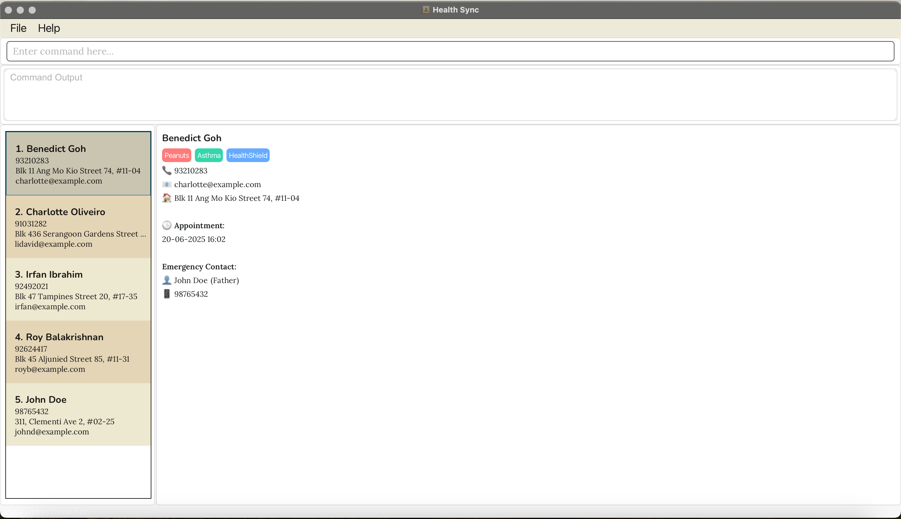

# HealthSync User Guide

---

HealthSync is a **desktop application for managing patient contacts and their emergency contacts, optimised for use via a Command Line Interface** (CLI) while still having the benefits of a Graphical User Interface (GUI). If you can type fast, HealthSync can get your patient management tasks done faster than traditional GUI apps.

---

**⚠️ Warning:** HealthSync is designed only for **Singapore-based family clinics**. It operates exclusively in **English** and does not support other languages or international clinic formats.

--- 
## Table of Contents
1. [Quick Start](#quick-start)
2. [Features](#features)
    - [Viewing help: `help`](#viewing-help-help)
    - [Adding a patient: `add`](#adding-a-patient-add)
    - [Listing all patients: `list`](#listing-all-patients-list)
    - [Sorting patients: `sort`](#sorting-patients-sort)
    - [Editing a patient: `edit`](#editing-a-patient-edit)
    - [Setting emergency contact: `emergency`](#setting-emergency-contact-emergency)
    - [Locating patients by name: `find`](#locating-patients-by-name-find)
    - [Archiving a patient: `archive`](#archiving-a-patient-archive)
    - [Listing archived patients: `listarchive`](#listing-archived-patients-listarchive)
    - [Unarchiving a patient: `unarchive`](#unarchiving-a-patient-unarchive)
    - [Deleting a patient: `delete`](#deleting-a-patient-delete)
    - [Clearing all entries: `clear`](#clearing-all-entries-clear)
    - [Tag Management](#tag-management)
        - [Adding a tag: `tag`](#adding-a-tag-tag)
        - [Deleting a tag: `tag`](#deleting-a-tag-tag)
    - [Undoing a command: `undo`](#undoing-a-command-undo)
    - [Redoing a command: `redo`](#redoing-a-command-redo)
    - [Exiting the program: `exit`](#exiting-the-program-exit)
    - [Saving the data](#saving-the-data)
    - [Editing the data file](#editing-the-data-file)
3. [FAQ](#faq)
4. [Known Issues](#known-issues)
5. [Command Summary](#command-summary)

--------------------------------------------------------------------------------------------------------------------

## Quick start

1. Ensure you have Java `17` or above installed in your Computer. 
   **Mac users:** Ensure you have the precise JDK version prescribed [here](https://se-education.org/guides/tutorials/javaInstallationMac.html).

1. Download the latest `.jar` file from [here](https://github.com/se-edu/addressbook-level3/releases).

1. Copy the file to the folder you want to use as the _home folder_ for HealthSync.

1. Open a command terminal, `cd` into the folder you put the jar file in, and use the `java -jar healthsync.jar` command to run the application. 
   A GUI similar to the below should appear in a few seconds. Note how the app contains some sample data. 
   

1. Type the command in the command box and press Enter to execute it. e.g. typing **`help`** and pressing Enter will open the help window. 
   Some example commands you can try:

   * `list` : Lists all patients.
   * `add n/John Doe p/98765432 e/johnd@example.com a/John street, block 123, #01-01` : Adds a patient named `John Doe` to HealthSync.
   * `emergency 1 n/John Smith p/98765432 r/Father` : Sets an emergency contact for the 1st patient.
   * `delete 3` : Deletes the 3rd patient shown in the current list.
   * `clear` : Deletes all patients.
   * `exit` : Exits the app.

1. Refer to the [Features](#features) below for details of each command.

--------------------------------------------------------------------------------------------------------------------

## Features

<box type="info" seamless>

**Notes about the command format:** 

* Words in `UPPER_CASE` are the parameters to be supplied by the user. 
  e.g. in `add n/NAME`, `NAME` is a parameter which can be used as `add n/John Doe`.

* Items in square brackets are optional. 
  e.g `n/NAME [t/TAG]` can be used as `n/John Doe t/friend` or as `n/John Doe`.

* Items with `…`​ after them can be used multiple times including zero times. 
  e.g. `[t/TAG]…​` can be used as ` ` (i.e. 0 times), `t/friend`, `t/friend t/family` etc.

* Parameters can be in any order. 
  e.g. if the command specifies `n/NAME p/PHONE_NUMBER`, `p/PHONE_NUMBER n/NAME` is also acceptable.

* Extraneous parameters for commands that do not take in parameters (such as `help`, `list`, `exit` and `clear`) will be ignored. 
  e.g. if the command specifies `help 123`, it will be interpreted as `help`.

* If you are using a PDF version of this document, be careful when copying and pasting commands that span multiple lines as space characters surrounding line-breaks may be omitted when copied over to the application.
</box>

### Viewing help : `help`

Shows a message explaining how to access the help page.

Format: `help`

### Adding a patient: `add`

Adds a patient to HealthSync.

Format: `add n/NAME p/PHONE_NUMBER e/EMAIL a/ADDRESS [t/TAG]…​`

<box type="tip" seamless>

**Tip:** A patient can have any number of tags (including 0)
</box>

Examples:
* `add n/John Doe p/98765432 e/johnd@example.com a/John street, block 123, #01-01`
* `add n/Betsy Crowe t/friend e/betsycrowe@example.com a/Newgate Prison p/1234567 t/criminal`

**⚠️ Warning:** If the name, phone, and email address are the same, the entry is considered a **duplicate**.

### Listing all patients : `list`

Shows a list of all patients in HealthSync.

Format: `list`

### Sorting patients : `sort`

Sorts the list of patients by a specified field.

Format: `sort FIELD`

* Sorts the patient list by the specified `FIELD`.
* Available fields: `name`, `appointment`
* The sorting is case-insensitive.

Examples:
* `sort name` Sorts patients by name in ascending order
* `sort appointment` Sorts patients by appointment date

### Editing a patient : `edit`

Edits an existing patient in HealthSync.

Format: `edit INDEX [n/NAME] [p/PHONE] [e/EMAIL] [a/ADDRESS] [t/TAG]…​`

* Edits the patient at the specified `INDEX`. The index refers to the index number shown in the displayed patient list. The index **must be a positive integer** 1, 2, 3, …​
* At least one of the optional fields must be provided.
* Existing values will be updated to the input values.

Examples:
*  `edit 1 p/91234567 e/johndoe@example.com` Edits the phone number and email address of the 1st patient to be `91234567` and `johndoe@example.com` respectively.
*  `edit 2 n/Betsy Crower t/` Edits the name of the 2nd patient to be `Betsy Crower` and clears all existing tags.

### Setting Emergency Contact : `emergency`

Sets or updates the emergency contact for a patient in HealthSync.

Format: `emergency INDEX n/NAME p/PHONE_NUMBER r/RELATIONSHIP`

* Sets the emergency contact for the patient at the specified `INDEX`.
* The index refers to the index number shown in the displayed patient list.
* The index **must be a positive integer** 1, 2, 3, …​
* All fields (name, phone, relationship) are required.

Examples:
* `emergency 1 n/John Smith p/98765432 r/Father` Sets the emergency contact for the 1st patient to be John Smith (Father) with phone number 98765432.

### Locating patients by name: `find`

Finds patients whose names contain any of the given keywords.

Format: `find KEYWORD [MORE_KEYWORDS]`

* The search is case-insensitive. e.g `hans` will match `Hans`
* The order of the keywords does not matter. e.g. `Hans Bo` will match `Bo Hans`
* Only the name is searched.
* Only full words will be matched e.g. `Han` will not match `Hans`
* Patients matching at least one keyword will be returned (i.e. `OR` search).
  e.g. `Hans Bo` will return `Hans Gruber`, `Bo Yang`

Examples:
* `find John` returns `john` and `John Doe`
* `find alex david` returns `Alex Yeoh`, `David Li` 
  

### Archive a patient : `archive`

Archives the specified patient from HealthSync. Removes patient from address book and adds them into archive list.

Format: `archive INDEX`

* Archives the patient at the specified `INDEX`.
* The index refers to the index number shown in the displayed patient list.
* The index **must be a positive integer** 1, 2, 3, …​

Examples:
* `list` followed by `archive 2` archives the 2nd patient in HealthSync.

### Listing all patients in archive : `listarchive`

Shows a list of all patients being archived.

Format: `listarchive`

### Unarchive a patient : `unarchive`

Remove the specified patient from archive list and add them back to HealthSync.

Format: `unarchive INDEX`

* Unarchive the patient at the specified `INDEX` from archive list.
* The index refers to the index number shown in the displayed patient list.
* The index **must be a positive integer** 1, 2, 3, …​

Examples:
* `listarchive` followed by `unarchive 2` adds the 2nd patient in archive list back to HealthSync.

### Deleting a patient : `delete`

Deletes the specified patient from HealthSync.

Format: `delete INDEX`

* Deletes the patient at the specified `INDEX`.
* The index refers to the index number shown in the displayed patient list.
* The index **must be a positive integer** 1, 2, 3, …​

Examples:
* `list` followed by `delete 2` deletes the 2nd patient in HealthSync.
* `find Betsy` followed by `delete 1` deletes the 1st patient in the results of the `find` command.

### Clearing all entries : `clear`

Clears all entries from HealthSync.

Format: `clear`

--------------------------------------------------------------------------------------------------------------------

## Tag Management

<box type="info" seamless>

### Adding a tag: `ta/ ti/ tc/`

Adds a tag to a person based on their patient_ID in the address book.
Tags can be added for allergies (ta/), insurance (ti/), or conditions (tc/).

Format: `tag <patient_ID> ta/ALLERGY`
         `tag <patient_ID> ti/INSURANCE`
         `tag <patient_ID> tc/CONDITION`

<box type="tip" seamless>

**Tip:** You can add tags for different categories such as allergy (`ta/`), insurance (`ti/`), and condition (`tc/`).
</box>

Examples:
* `tag 1 ta/peanuts`
* `tag 2 ti/prudential`
* `tag 3 tc/diabetes`

**⚠️ Warning:** If the tag already exists for the person, it will not be added again.

---

### Deleting a tag: `td/`

Deletes a tag from a person based on their patient_ID in the address book.

Format: `tag <patient_ID> td/TAGNAME`

<box type="tip" seamless>

**Tip:** You can delete one or more tags from a person based on their index.
</box>

Examples:
* `tag 1 td/peanuts`
* `tag 2 td/diabetes`

**⚠️ Warning:** Deleting a tag cannot be undone. Ensure the tag is no longer needed before deleting.

--------------------------------------------------------------------------------------------------------------------

### Undoing a command: `undo`

Reverts the last command that modified data.

Format: `undo`

**⚠️ Warning:**
* Can be used repeatedly to undo multiple actions.
* Cannot undo `undo`, `redo`, `help`, or `exit` commands.

Examples:
* `undo` (Restores the state before the last action)

### Redoing a command: `redo`

Restores the last undone command.

Format: `redo`

**⚠️ Warning:**
* Can only be used if `undo` was previously executed.
* Cannot redo commands that were not undone.

Examples:
* `redo` (Restores the last undone action)

### Exiting the program : `exit`

Exits the program.

Format: `exit`

### Saving the data

HealthSync data are saved in the hard disk automatically after any command that changes the data. There is no need to save manually.

### Editing the data file

HealthSync data are saved automatically as a JSON file `[JAR file location]/data/addressbook.json`. Advanced users are welcome to update data directly by editing that data file.

<box type="warning" seamless>

**Caution:**
If your changes to the data file makes its format invalid, AddressBook will discard all data and start with an empty data file at the next run.  Hence, it is recommended to take a backup of the file before editing it. 
Furthermore, certain edits can cause the AddressBook to behave in unexpected ways (e.g., if a value entered is outside the acceptable range). Therefore, edit the data file only if you are confident that you can update it correctly.
</box>

--------------------------------------------------------------------------------------------------------------------

## FAQ

**Q**: How do I transfer my data to another Computer? 
**A**: Install the app in the other computer and overwrite the empty data file it creates with the file that contains the data of your previous AddressBook home folder.

--------------------------------------------------------------------------------------------------------------------

## Known issues

1. **When using multiple screens**, if you move the application to a secondary screen, and later switch to using only the primary screen, the GUI will open off-screen. The remedy is to delete the `preferences.json` file created by the application before running the application again.
2. **If you minimise the Help Window** and then run the `help` command (or use the `Help` menu, or the keyboard shortcut `F1`) again, the original Help Window will remain minimised, and no new Help Window will appear. The remedy is to manually restore the minimized Help Window.

--------------------------------------------------------------------------------------------------------------------

## Command summary

| **Action**                 | **Format, Examples**                                                                                                             |
|----------------------------|----------------------------------------------------------------------------------------------------------------------------------|
| **Add Patient**            | `add n/NAME p/PHONE e/EMAIL a/ADDRESS [t/TAG]…​` e.g., `add n/John Doe p/98765432 e/john@example.com a/123 Street t/diabetes` |
| **Edit Patient**           | `edit INDEX [n/NAME] [p/PHONE] [e/EMAIL] [a/ADDRESS] [t/TAG]…​` e.g., `edit 2 n/John Smith p/91234567`                        |
| **Delete Patient**         | `delete INDEX` e.g., `delete 3`                                                                                               |
| **Find Patient**           | `find KEYWORD [MORE_KEYWORDS]` e.g., `find John`                                                                              |
| **List Patients**          | `list`                                                                                                                           |
| **Sort Patients**          | `sort FIELD` e.g., `sort name`                                                                                                |
| **Set Emergency Contact**  | `emergency INDEX n/NAME p/PHONE r/RELATIONSHIP` e.g., `emergency 1 n/Jane Doe p/81234567 r/Mother`                            |
| **Archive Patient**        | `archive INDEX` e.g., `archive 2`                                                                                             |
| **List Archived Patients** | `listarchive`                                                                                                                    |
| **Unarchive Patient**      | `unarchive INDEX` e.g., `unarchive 2`                                                                                         |
| **Clear All Entries**      | `clear`                                                                                                                          |
| **Undo Command**           | `undo`                                                                                                                           |
| **Redo Command**           | `redo`                                                                                                                           |
| **Add Allergy Tag**        | `tag INDEX ta/ALLERGY` e.g., `tag 1 ta/peanuts`                                                                               |
| **Add Condition Tag**      | `tag INDEX tc/CONDITION` e.g., `tag 1 tc/asthma`                                                                              |
| **Add Insurance Tag**      | `tag INDEX ti/INSURANCE` e.g., `tag 1 ti/medishield`                                                                          |
| **Delete Tag**             | `tag INDEX td/TAGNAME` e.g., `tag 1 td/peanuts`                                                                               |
| **Help**                   | `help`                                                                                                                           |
| **Exit**                   | `exit`                                                                                                                           |
